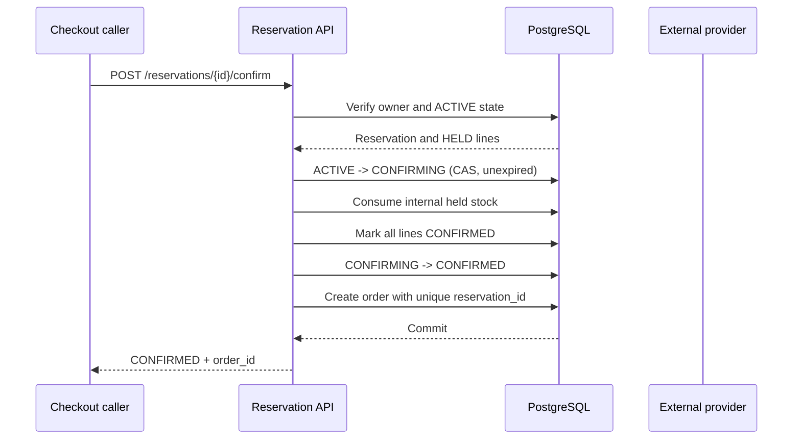

# Confirmation flow

External provider calls are not made during this confirmation transaction in
the current implementation. External lines already represent successful
provider holds; confirmation finalizes the local reservation and order.

