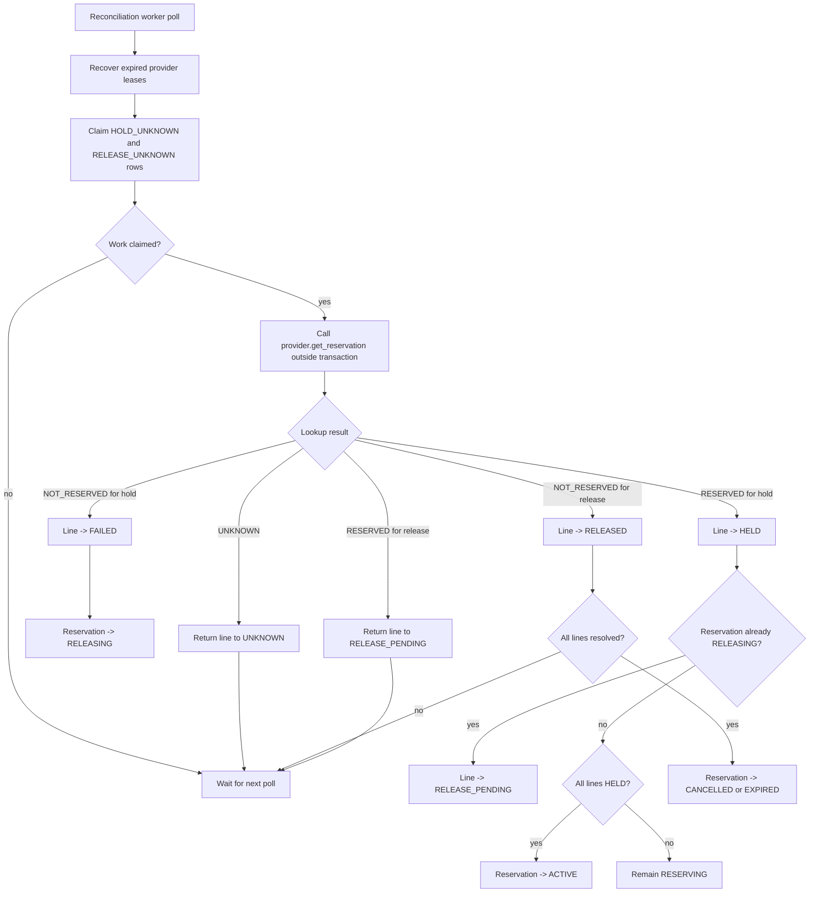
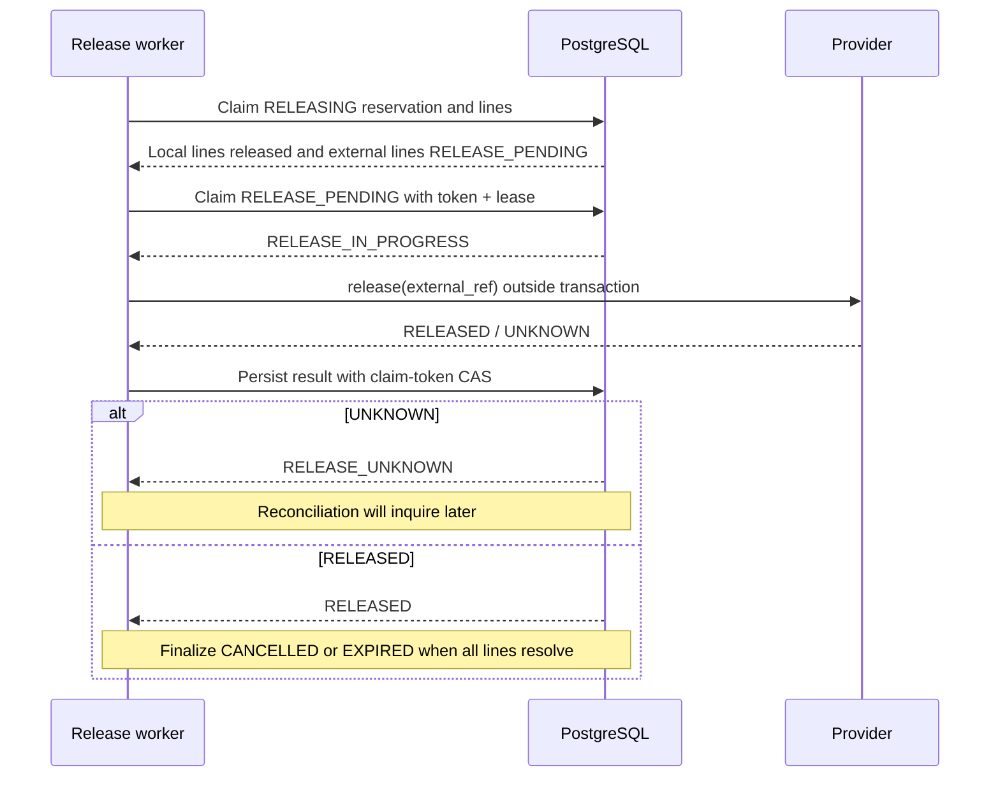

# Reconciliation and compensation flow

Unknown outcomes are retried through polling and lease recovery. The current
implementation has no attempt counter or exponential backoff; it relies on
the configured polling interval and provider claim lease.
