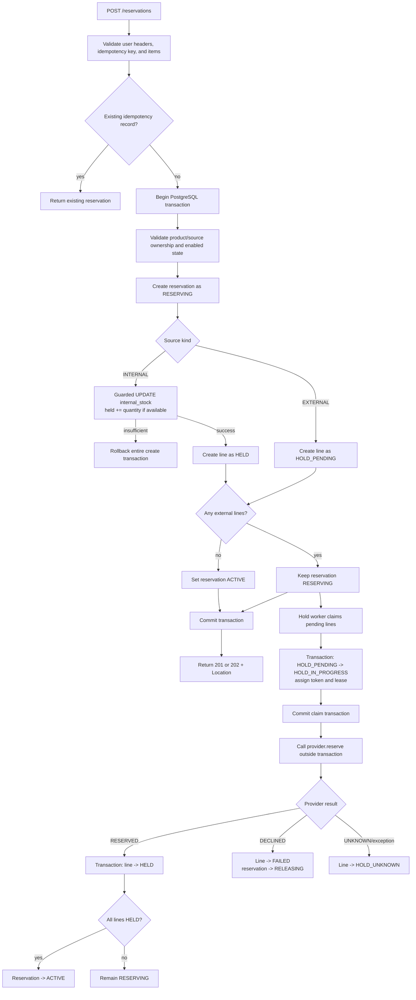

# Create and provider-hold flow

The initial transaction is atomic for local state. Provider effects are not
part of that transaction. A result is persisted in a second transaction after
the provider call; if that write fails, lease recovery and reconciliation
investigate the provider instead of assuming failure.
