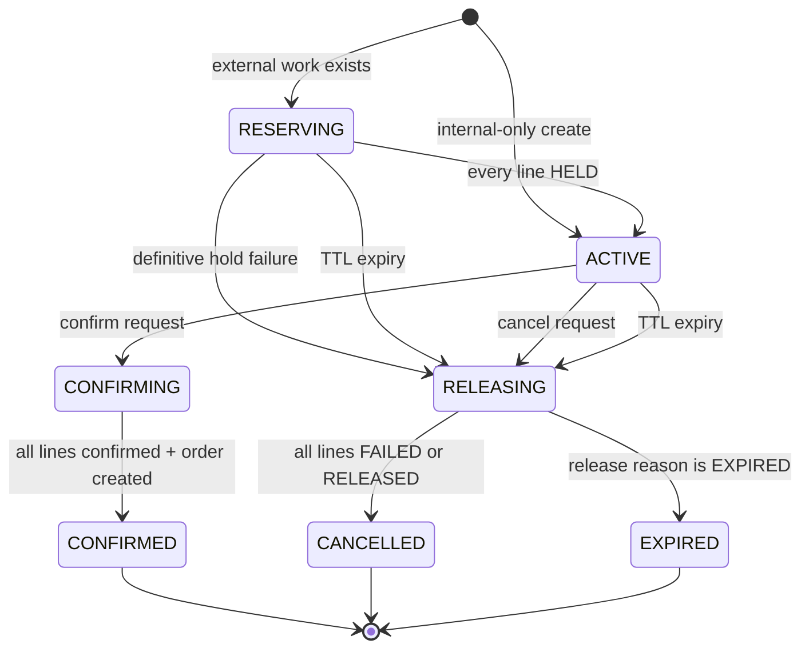
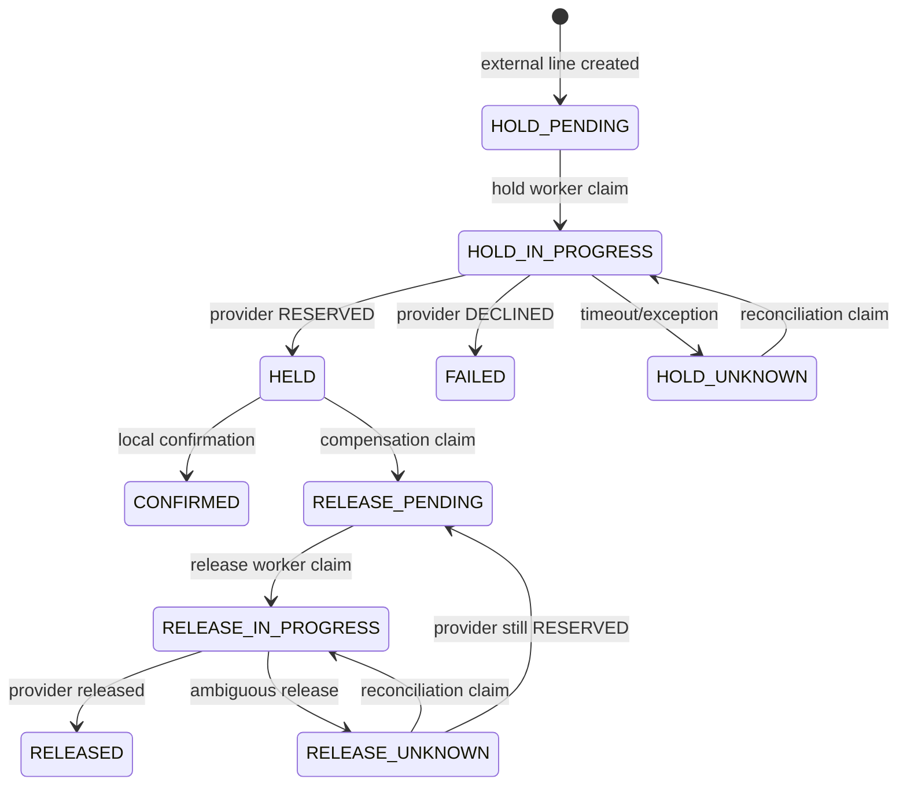

# Reservation lifecycle

There is no reservation-level `FAILED` state. A definitive line failure moves
the reservation to `RELEASING`; compensation then ends it as `CANCELLED` (or
`EXPIRED` when the reason is TTL expiry).

